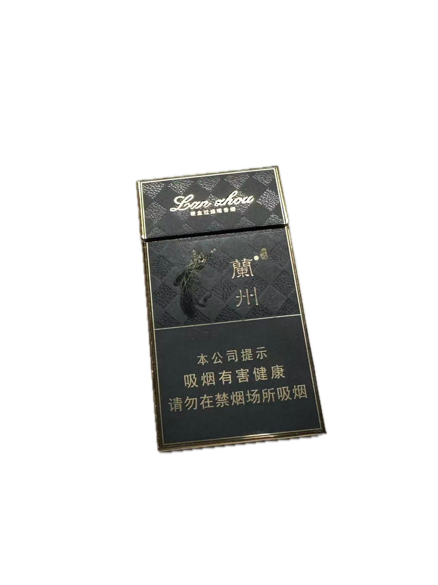

# 兰州系列吸后感🚬

> 感谢本文赞助商***小欣宜***女士，感谢您让我一下抽了那么多兰州🥰
>
> ***LeonSong***  ***October 15, 2025 in Shanghai***

> [!WARNING]
>
> 必须声明的是，我很喜欢你带的礼物，而这份礼物不仅仅是烟本身，它只作为礼物的一小部分，而是你的心意和千里迢迢带过来的行为，我也许对一些作出了比较中肯的评价，但心意永远💯

☡ 兰州细支珍品 烤烟

稍稍逊色于兰州中支，但细品后的梅子味比中支浓厚。

不同于大部分细烟，比较辣，劲大。

🙋 包装深得我心

☡ 兰州吉祥 粗支 烤烟

包装一眼经典老式包装，应该是本地烟民的口粮烟类型。抽起来很像安徽的云烟，劲大不用多说；

有个通病就是烟草有点松，点烟的时候像把柴火一下点着了，个人不太喜欢这种感觉。

☡ 兰州吉祥 中支 烤烟

是上个是卵生兄弟，第一次见一盒里只有16支的香烟，很新奇；焦香感比较浓厚，但是比粗支吉祥更柔和

☡ 兰州-桥 细支 烤烟

第一口有被震惊到，它的烟嘴是像煊赫门那样上了甜味剂的，喜欢煊赫门的大概率也会比较钟意他，其他方面没有什么差异

☡ 兰州-飞天梦 细支 烤烟

emmm，总结出来了一个规律，兰州的烟还是比较有地域特色的，盒子上几乎都有敦煌壁画的元素；这个包装很喜庆。

焦油味比较重，口感偏甜，我觉得像是甘肃的面子烟。

☡ 兰州-小青支 中支 烤烟

烟盒比较清新，烟嘴也是像外包装那样的青色，外观看起来像是一个“文弱书生”，比我想象中的劲大，燃烧速度比较慢，挺耐抽的。

☡ 兰州-花径 中支 烤烟

包装无敌无敌无敌，这小浮雕谁看了不迷糊。虽然是中支但是有点剌嗓子，很奇怪的是烟气比较淡，烟嘴有一点点塑料的感觉，这个价位的话我觉得它还是比较适合放在家里观赏。

☡ 兰州-黑中支 烤烟

我先不说话，听听它怎么说？

“势均力敌吗我要的是绝对压制”

评价什么不用评价了，这小银黑包装，这小磨砂质感，这小星空镭射膜，兰州系列没烟能比，除了帅气无话可说，黑中支就是王，就是神，就是上帝！！！
如果我在兰州只有一种烟可以抽，那就是黑兰州。

看完不撒花我会生气的哦💢

